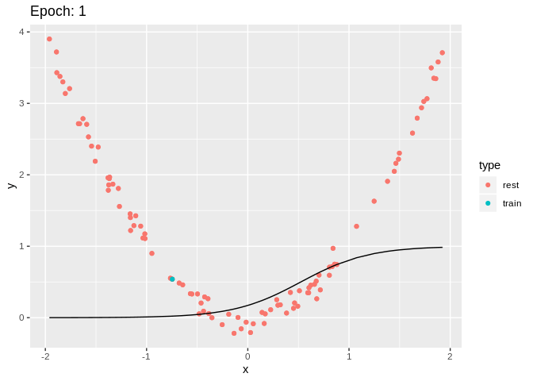
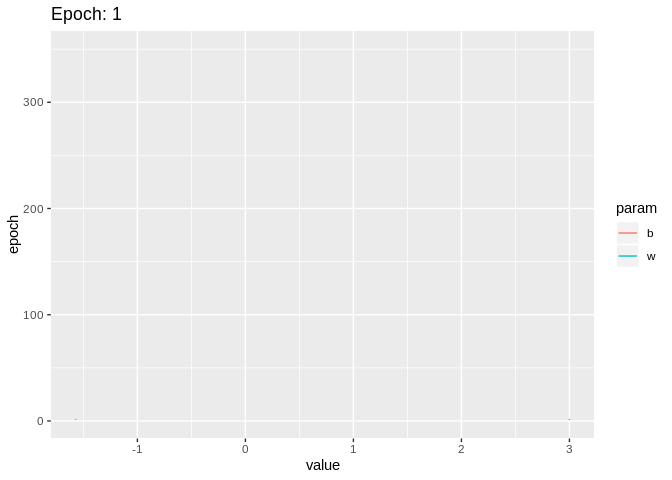
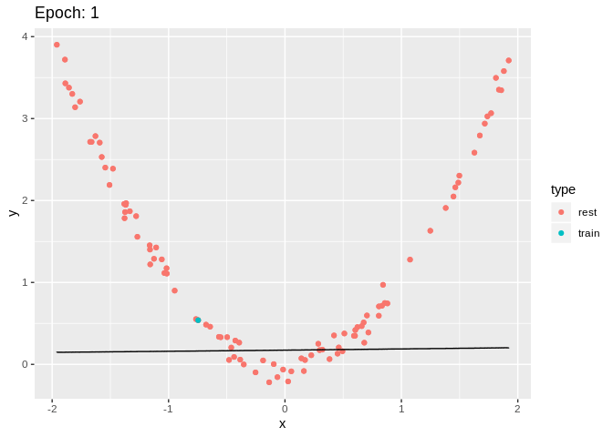
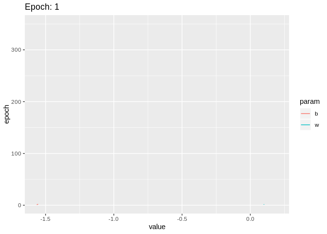

```{r setup, include=FALSE}
library(knitr)

knitr::opts_chunk$set(collapse = TRUE, comment = NA, prompt = FALSE, echo = TRUE, cache = TRUE, fig.align = 'center')
```

```{r}
library(dnnteach)
library(ggplot2)
library(tibble)
library(gganimate)
library(plyr)
library(dplyr)
library(tidyr)
library(gifski)
```


```{r}
set.seed(43)

w <- rnorm(1)
b <- rnorm(1)

X <- runif(100, -2, 2)
Y <- quadratic(X) + rnorm(length(X), sd=.1)
```


```{r}
to_frames_data <- function(trace) {
  trace %>%
    ddply(.(epoch), function(row) {
      bind_rows(
        tibble(x = X, y = Y, type = 'rest'),
        tibble(x = X[1], y = Y[1], type = 'train'),
        tibble(x = X, y = nn_response(X, epoch = row), type = 'neuron')
      )
    }) %>%
    as_tibble
}

plot_frame <- function(data) {
  ggplot() +
    geom_point(data = filter(data, type != 'neuron'), aes(x = x, y = y, color = type)) +
    geom_line(data = filter(data, type == 'neuron'), aes(x = x, y = y))
}
```


# Update only `w`

```{r b_15}
epoch <- function(X, Y, w, b, eta) {
  tr <- lapply(seq(length(X)), function(i) {
    ans <- single_step(X[i], Y[i], w, b, eta)
    w <<- ans$w
    ans$b <- b # do not use the updated bias
    ans
  })

  tr <- lapply(tr, function(p) {
    unlist(p[c("w", "b", "loss")])
  })

  bind_cols(step = seq_along(tr), as_tibble(do.call(rbind, tr)))
}

optimize <- function(X, Y, w, b, eta, epochs) {
  ldply(seq(epochs), function(no) {
    e <- epoch(X, Y, w, b, eta)
    w <<- extract_weights(epoch = tail(e, 1))
    #b <<- extract_biases(epoch = tail(e, 1))

    tail(e, 1) %>%
      mutate(epoch = no, loss = mean(e$loss)) %>%
      select(-step)
  }) %>% as_tibble
}
```


```{r}
trace <- optimize(X[1], Y[1], w, b, 0.1, 350)
fdata <- to_frames_data(trace)

p1 <-
  fdata %>%
  plot_frame + transition_time(epoch) + labs(title = "Epoch: {frame_time}")

p2 <-
  trace %>%
  pivot_longer(c("w", "b"), "param") %>%
  ggplot() +
  geom_line(aes(y = epoch, x = value, color = param)) +
  transition_reveal(epoch) +
  labs(title = "Epoch: {frame_along}")
```

```{r gif1, message = FALSE, warning = FALSE, results = FALSE, cache = TRUE}
anim_save("onlyw_neuron.gif", p1)
anim_save("onlyw_wb.gif", p2)
```

{width=49%} {width=49%}


# Update only `b`

```{r}
epoch <- function(X, Y, w, b, eta) {
  tr <- lapply(seq(length(X)), function(i) {
    ans <- single_step(X[i], Y[i], w, b, eta)
    ans$w <- w # do not use the updated weight
    b <<- ans$b
    ans
  })

  tr <- lapply(tr, function(p) {
    unlist(p[c("w", "b", "loss")])
  })

  bind_cols(step = seq_along(tr), as_tibble(do.call(rbind, tr)))
}

optimize <- function(X, Y, w, b, eta, epochs) {
  ldply(seq(epochs), function(no) {
    e <- epoch(X, Y, w, b, eta)
    #w <<- extract_weights(epoch = tail(e, 1))
    b <<- extract_biases(epoch = tail(e, 1))

    tail(e, 1) %>%
      mutate(epoch = no, loss = mean(e$loss)) %>%
      select(-step)
  }) %>% as_tibble
}
```


## `w=3`

```{r w3}
trace <- optimize(X[1], Y[1], 3, b, 0.1, 350)
fdata <- to_frames_data(trace)

p1 <-
  fdata %>%
  plot_frame + transition_time(epoch) + labs(title = "Epoch: {frame_time}")

p2 <-
  trace %>%
  pivot_longer(c("w", "b"), "param") %>%
  ggplot() +
  geom_line(aes(y = epoch, x = value, color = param)) +
  transition_reveal(epoch) +
  labs(title = "Epoch: {frame_along}")
```

```{r gif2, message = FALSE, warning = FALSE, results = FALSE, cache = TRUE}
anim_save("onlybw3_neuron.gif", p1)
anim_save("onlybw3_wb.gif", p2)
```

{width=49%} {width=49%}


## `w=0.1`

```{r w01}
trace <- optimize(X[1], Y[1], .1, b, 0.1, 350)
fdata <- to_frames_data(trace)

p1 <-
  fdata %>%
  plot_frame + transition_time(epoch) + labs(title = "Epoch: {frame_time}")

p2 <-
  trace %>%
  pivot_longer(c("w", "b"), "param") %>%
  ggplot() +
  geom_line(aes(y = epoch, x = value, color = param)) +
  transition_reveal(epoch) +
  labs(title = "Epoch: {frame_along}")
```

```{r gif3, message = FALSE, warning = FALSE, results = FALSE, cache = TRUE}
anim_save("onlybw01_neuron.gif", p1)
anim_save("onlybw01_wb.gif", p2)
```

{width=49%} {width=49%}


